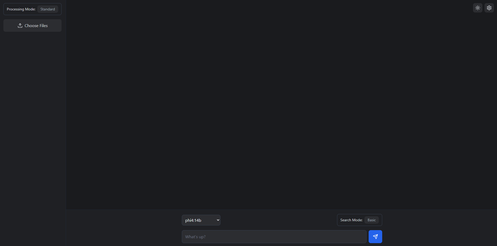

# Local RAG

A fully local AI-powered document processing and search system.

Local RAG is a robust Retrieval-Augmented Generation (RAG) application that uses Ollama local models and FAISS for efficient document processing and semantic search capabilities.



**[👉 Watch the full demo video on YouTube](https://youtu.be/V4CvTF1M_-8)**

## Overview

This application provides an enhanced RAG implementation with the following key features:

- **Multi-format document processing**: Support for PDF, DOCX, CSV, Excel, XML, and images
- **Semantic search with content-type awareness**: Intelligent document understanding
- **Batch processing for large files**: Handle big documents and multiple files efficiently
- **Rate limiting and error handling**: Reliable API performance
- **Automatic backup and recovery**: Data integrity protection
- **Enhanced query expansion and results reranking**: Better search results
- **Faceted search capabilities**: Filter and navigate search results
- **OCR support for images**: Extract text from images and PDFs
- **Progress tracking and webhook notifications**: Monitor long-running tasks

## Project Structure

```
/
├── backend/                 # Python FastAPI backend
│   ├── app/                 # Main application package
│   │   ├── api/             # API endpoints and models
│   │   ├── core/            # Core settings and logging
│   │   ├── prompts/         # LLM prompt templates
│   │   ├── services/        # Business logic services
│   │   └── utils/           # Utility functions
│   ├── data/                # Data storage directory
│   └── requirements.txt     # Python dependencies
│
├── frontend/                # React.js frontend
│   ├── public/              # Public assets
│   ├── src/                 # Source code
│   │   ├── components/      # React components
│   │   ├── contexts/        # React contexts
│   │   └── styles/          # CSS and styling
│   └── package.json         # JavaScript dependencies
│
├── .gitignore              # Git ignore file
└── README.md                # This file
```

## System Requirements

- **OS**: Windows 10/11, macOS, or Linux
- **CPU**: 4+ cores recommended for faster processing
- **RAM**: Minimum 8GB, 16GB+ recommended for large documents
- **Storage**: 10GB+ free space for application and models
- **GPU**: Required, at least 4GB dedicated GPU RAM for model inference

## Quick Start

1. Clone the repository
   ```bash
   git clone https://github.com/yourusername/localrag.git
   cd localrag
   ```

#### Backend Setup

1. Navigate to the backend directory
   ```bash
   cd backend
   ```

2. Create and activate a virtual environment
   ```bash
   python -m venv venv
   source venv/bin/activate  # On Windows: venv\Scripts\activate
   ```

3. Install required packages
   ```bash
   pip install -r requirements.txt
   ```

4. Start the backend server
   ```bash
   python -m app.main
   ```

#### Frontend Setup

1. Navigate to the frontend directory
   ```bash
   cd frontend
   ```

2. Install dependencies
   ```bash
   npm install
   ```

3. Start the frontend development server
   ```bash
   npm start
   ```

4. Open your browser and navigate to http://localhost:3000

## Ollama Setup

This application requires Ollama for running LLM models locally:

1. Install Ollama from [https://ollama.ai/](https://ollama.ai/)

2. Pull the required models:
   ```bash
   ollama pull deepseek-r1:8b
   ```

3. Ensure Ollama is running before starting the application

## Usage Examples

### Document Processing Workflow

1. **Upload Documents**: Use the file upload in the sidebar to add documents
2. **Preview Content**: Click on files to preview their content
3. **Ask Questions**: Use the chat interface to ask questions about your documents
4. **View Results**: Get AI-generated answers with references to source material

### Enhanced Search Options

1. Toggle "Enhanced Search" mode for more powerful search capabilities
2. Use natural language to find information across all your documents
3. View faceted search results with filters and highlights
4. Get semantically relevant results even with different terminology

### Batch Processing

1. Toggle "Batch Mode" when uploading large or multiple files
2. Monitor progress through the batch processing interface
3. Receive notifications when batch processing completes
4. Access processed documents directly from the interface

## Configuration

### Backend Configuration

Key backend settings can be adjusted in `backend/app/core/config.py`:

- `OLLAMA_API_URL`: URL for the Ollama API
- `TEXT_EMBEDDING_MODEL`: Model for text embeddings
- `CHUNK_SIZE`: Size of text chunks for processing
- `RATE_LIMIT_MAX_REQUESTS`: Rate limiting settings

### Frontend Configuration

Frontend settings can be adjusted through the settings interface or directly in `frontend/src/App.js`:

- Ollama API endpoint
- Model parameters
- UI preferences
- Search behavior

## Documentation

- [Backend API Documentation](backend/README.md)
- [Frontend Documentation](frontend/README.md)

## Contributing

Contributions are welcome! Please feel free to submit a Pull Request.

1. Fork the repository
2. Create your feature branch (`git checkout -b feature/amazing-feature`)
3. Commit your changes (`git commit -m 'Add some amazing feature'`)
4. Push to the branch (`git push origin feature/amazing-feature`)
5. Open a Pull Request

## License

This project is licensed under the MIT License - see the LICENSE file for details.

## Acknowledgments

- [Ollama](https://ollama.ai/) for providing local LLM capabilities
- [FastAPI](https://fastapi.tiangolo.com/) for the backend framework
- [React](https://reactjs.org/) for the frontend framework
- [FAISS](https://github.com/facebookresearch/faiss) for efficient similarity search
- [Sentence Transformers](https://www.sbert.net/) for text embeddings